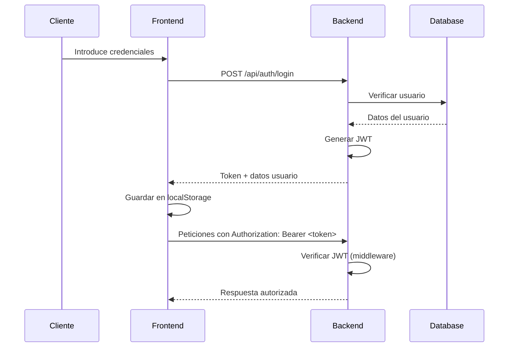

# 🛍️ Tienda Online - E-commerce Full Stack

Un sistema completo de e-commerce desarrollado con **Node.js + Express** en el backend y **JavaScript vanilla** en el frontend. Diseñado como proyecto educativo para enseñar desarrollo web full-stack moderno.

## 📋 Tabla de Contenidos

- [🎯 Características](#-características)
- [🏗️ Arquitectura](#️-arquitectura)
- [🚀 Tecnologías](#-tecnologías)
- [📦 Instalación](#-instalación)
- [🔧 Configuración](#-configuración)
- [🚦 Ejecución](#-ejecución)
- [📚 API Endpoints](#-api-endpoints)
- [🎨 Frontend](#-frontend)
- [💾 Base de Datos](#-base-de-datos)
- [🔐 Autenticación](#-autenticación)
- [📖 Guía de Uso](#-guía-de-uso)
- [🎓 Valor Educativo](#-valor-educativo)
- [🤝 Contribución](#-contribución)

## 🎯 Características

### ✨ Funcionalidades Core
- **🛒 Sistema de Carrito**: Agregar, modificar y eliminar productos
- **🔐 Autenticación JWT**: Registro y login seguro de usuarios
- **📦 Gestión de Productos**: Catálogo completo con stock y precios
- **🛍️ Gestión de Pedidos**: Crear y consultar historial de compras
- **📱 Diseño Responsivo**: Interfaz adaptable a móviles y desktop

### 🛡️ Seguridad
- Autenticación JWT con middleware de protección
- Validación de datos en frontend y backend
- Verificación de stock en tiempo real
- Headers CORS configurados correctamente
- Contraseñas hasheadas con bcrypt

### 🎯 Características Educativas
- **Código extensamente comentado** para fines didácticos
- **Arquitectura MVC** bien estructurada
- **Separación clara** entre frontend y backend
- **Buenas prácticas** de desarrollo web
- **Patrones de diseño** aplicados y explicados

## 🏗️ Arquitectura

```
tienda-clase/
├── 📁 backend/           # API REST con Express.js
│   ├── 📄 server.js      # Servidor principal
│   ├── 📁 config/        # Configuración de BD
│   ├── 📁 controllers/   # Lógica de negocio
│   ├── 📁 models/        # Modelos de datos
│   ├── 📁 routes/        # Rutas de la API
│   ├── 📁 middlewares/   # Middleware de autenticación
│   └── 📄 initdb.js      # Inicialización de BD
├── 📁 frontend/          # Cliente JavaScript vanilla
│   ├── 📄 index.html     # Interfaz principal
│   ├── 📄 app.js         # Lógica del frontend (documentado)
│   └── 📄 styles.css     # Estilos responsivos
└── 📄 README.md          # Esta documentación
```

### 🔄 Flujo de Datos

```
┌─────────────┐    HTTP/JSON    ┌─────────────┐    SQL    ┌─────────────┐
│  Frontend   │ ◄──────────────► │   Backend   │ ◄────────► │    MySQL    │
│ (Vanilla JS)│                  │ (Express.js)│            │             │
└─────────────┘                  └─────────────┘            └─────────────┘
      │                                │                           │
      ├── 🎨 Interfaz de Usuario       ├── 🔐 Autenticación JWT    ├── 👥 Usuarios
      ├── 🛒 Gestión de Carrito        ├── 📦 API REST             ├── 📦 Productos
      ├── 📱 Responsividad             ├── ✅ Validaciones          └── 🛍️ Pedidos
      └── 🔄 Estado Global             └── 🛡️ Middleware
```

## 🚀 Tecnologías

### Backend
- **Runtime**: Node.js 18+
- **Framework**: Express.js 4.x
- **Base de Datos**: MySQL 8.0+
- **Autenticación**: JWT (jsonwebtoken)
- **Hashing**: bcrypt
- **ORM**: mysql2 (queries directas)
- **Variables de Entorno**: dotenv

### Frontend
- **Lenguajes**: HTML5, CSS3, JavaScript ES6+
- **Metodología**: Vanilla JS (sin frameworks)
- **Comunicación**: Fetch API
- **Persistencia**: localStorage
- **Diseño**: CSS Grid/Flexbox

### DevOps
- **Desarrollo**: nodemon (hot reload)
- **Variables**: dotenv
- **CORS**: cors middleware

## 📦 Instalación

### Prerrequisitos
- **Node.js 18+** instalado
- **MySQL 8.0+** ejecutándose
- **Git** para clonar el repositorio

### Pasos de Instalación

```bash
# 1. Clonar el repositorio
git clone https://github.com/inma2709/tienda-clase.git
cd tienda-clase

# 2. Instalar dependencias del backend
cd backend
npm install

# 3. Configurar base de datos (ver sección configuración)

# 4. Inicializar base de datos
node initdb.js

# 5. Iniciar servidor de desarrollo
npm run dev
```

## 🔧 Configuración

### 1. Variables de Entorno

Crear archivo `.env` en la carpeta `backend/`:

```env
# Configuración de Base de Datos
DB_HOST=localhost
DB_USER=tu_usuario_mysql
DB_PASSWORD=tu_contraseña_mysql
DB_NAME=tienda_online

# Configuración JWT
JWT_SECRET=tu_clave_secreta_muy_segura_aqui

# Configuración del Servidor
PORT=3000
NODE_ENV=development
```

### 2. Base de Datos MySQL

```sql
-- Crear base de datos
CREATE DATABASE tienda_online;
USE tienda_online;

-- Las tablas se crean automáticamente con initdb.js
```

### 3. Frontend

El frontend no requiere configuración adicional. Simplemente abrir `frontend/index.html` en un navegador o usar Live Server.

## 🚦 Ejecución

### Desarrollo

```bash
# Terminal 1: Backend (puerto 3000)
cd backend
npm run dev

# Terminal 2: Frontend (Live Server recomendado)
# Abrir frontend/index.html con Live Server en VS Code
# O abrir directamente en navegador
```

### URLs de Acceso
- **Frontend**: `http://127.0.0.1:5500` (con Live Server)
- **Backend API**: `http://localhost:3000`
- **Health Check**: `http://localhost:3000/` (debe mostrar mensaje de éxito)

## 📚 API Endpoints

### 🔓 Endpoints Públicos

| Método | Ruta | Descripción |
|--------|------|-------------|
| `GET` | `/` | Health check del servidor |
| `GET` | `/api/productos` | Obtener catálogo de productos |
| `POST` | `/api/auth/register` | Registrar nuevo usuario |
| `POST` | `/api/auth/login` | Iniciar sesión |

### 🔐 Endpoints Protegidos (Requieren JWT)

| Método | Ruta | Descripción |
|--------|------|-------------|
| `POST` | `/api/pedidos` | Crear nuevo pedido |
| `GET` | `/api/pedidos/mis-pedidos` | Obtener mis pedidos |

### Ejemplos de Uso

#### Registrar Usuario
```bash
curl -X POST http://localhost:3000/api/auth/register \
  -H "Content-Type: application/json" \
  -d '{
    "nombre": "Juan Pérez",
    "email": "juan@example.com",
    "password": "123456"
  }'
```

#### Crear Pedido
```bash
curl -X POST http://localhost:3000/api/pedidos \
  -H "Content-Type: application/json" \
  -H "Authorization: Bearer TU_JWT_TOKEN" \
  -d '{
    "productos": [
      {"producto_id": 1, "cantidad": 2},
      {"producto_id": 3, "cantidad": 1}
    ]
  }'
```

## 🎨 Frontend

### Características Técnicas

- **📱 Diseño Responsivo**: CSS Grid + Flexbox
- **🔄 Estado Centralizado**: Objeto global que simula Redux
- **🎯 Componentes Reutilizables**: Funciones especializadas
- **🔐 Autenticación Persistente**: localStorage + JWT
- **✅ Validación en Tiempo Real**: Feedback inmediato

### Funcionalidades

```javascript
// Estado global de la aplicación
let estado = {
  usuario: null,        // Usuario autenticado
  token: null,          // JWT token
  productos: [],        // Catálogo de productos
  carrito: []          // Carrito de compras
};
```

### Flujo de Usuario

1. **👤 Registro/Login**: El usuario se autentica
2. **📦 Explorar Productos**: Ve el catálogo completo
3. **🛒 Agregar al Carrito**: Selecciona productos y cantidades
4. **✅ Validaciones**: El sistema verifica stock y autenticación
5. **🛍️ Crear Pedido**: Convierte carrito en pedido
6. **📋 Historial**: Ve sus pedidos anteriores

## 💾 Base de Datos

### Esquema de Tablas

```sql
-- Tabla de clientes
CREATE TABLE clientes (
    id INT AUTO_INCREMENT PRIMARY KEY,
    nombre VARCHAR(100) NOT NULL,
    email VARCHAR(100) UNIQUE NOT NULL,
    password VARCHAR(255) NOT NULL,
    fecha_registro TIMESTAMP DEFAULT CURRENT_TIMESTAMP
);

-- Tabla de productos
CREATE TABLE productos (
    id INT AUTO_INCREMENT PRIMARY KEY,
    nombre VARCHAR(100) NOT NULL,
    descripcion TEXT,
    precio DECIMAL(10,2) NOT NULL,
    stock INT NOT NULL DEFAULT 0,
    fecha_creacion TIMESTAMP DEFAULT CURRENT_TIMESTAMP
);

-- Tabla de pedidos
CREATE TABLE pedidos (
    id INT AUTO_INCREMENT PRIMARY KEY,
    cliente_id INT NOT NULL,
    estado ENUM('pendiente', 'procesando', 'enviado', 'entregado') DEFAULT 'pendiente',
    fecha TIMESTAMP DEFAULT CURRENT_TIMESTAMP,
    FOREIGN KEY (cliente_id) REFERENCES clientes(id)
);

-- Tabla intermedia de pedidos y productos
CREATE TABLE pedidos_productos (
    pedido_id INT NOT NULL,
    producto_id INT NOT NULL,
    cantidad INT NOT NULL,
    PRIMARY KEY (pedido_id, producto_id),
    FOREIGN KEY (pedido_id) REFERENCES pedidos(id),
    FOREIGN KEY (producto_id) REFERENCES productos(id)
);
```

### Datos de Ejemplo

El archivo `initdb.js` inicializa la base de datos con:
- **👤 Usuario demo**: `admin@tienda.com` / `123456`
- **📦 5 productos** de ejemplo con stock
- **🛍️ Pedido demo** para mostrar funcionalidad

## 🔐 Autenticación

### Flujo JWT



### Middleware de Protección

```javascript
// auth.middleware.js
const jwt = require('jsonwebtoken');

const verificarToken = (req, res, next) => {
  const authHeader = req.headers.authorization;
  const token = authHeader && authHeader.split(' ')[1];
  
  if (!token) return res.status(401).json({ message: 'Token requerido' });
  
  jwt.verify(token, process.env.JWT_SECRET, (err, user) => {
    if (err) return res.status(401).json({ message: 'Token inválido' });
    req.user = user;
    next();
  });
};
```

## 📖 Guía de Uso

### Para Desarrolladores

1. **🚀 Inicio Rápido**
   ```bash
   npm run dev    # Backend en puerto 3000
   # Abrir frontend/index.html en navegador
   ```

2. **🔍 Testing de API**
   - Usar Postman o Insomnia
   - Probar endpoints públicos primero
   - Obtener JWT con login para endpoints protegidos

3. **🛠️ Desarrollo**
   - Backend con nodemon (hot reload automático)
   - Frontend con Live Server para recarga automática
   - Console del navegador para debugging

### Para Estudiantes

1. **📚 Estudiar el Código**
   - Empezar por `server.js` (entrada del backend)
   - Revisar `app.js` (lógica del frontend, extensamente comentado)
   - Analizar la estructura MVC en carpetas

2. **🧪 Experimentar**
   - Modificar estilos en `styles.css`
   - Agregar nuevos productos en `initdb.js`
   - Crear nuevos endpoints siguiendo el patrón

3. **🎯 Ejercicios Sugeridos**
   - Agregar campo "categoría" a productos
   - Implementar búsqueda de productos
   - Agregar sistema de favoritos
   - Implementar carrito persistente en backend

## 🎓 Valor Educativo

### Conceptos Aprendidos

#### Backend (Express.js + MySQL)
- ✅ **Arquitectura MVC**: Separación clara de responsabilidades
- ✅ **API REST**: Endpoints bien estructurados
- ✅ **Autenticación JWT**: Sistema de tokens moderno
- ✅ **Base de Datos**: Diseño relacional y consultas SQL
- ✅ **Middleware**: Funciones reutilizables
- ✅ **Validación de Datos**: Sanitización y verificación
- ✅ **Manejo de Errores**: Try/catch y middleware global

#### Frontend (JavaScript Vanilla)
- ✅ **Gestión de Estado**: Centralizado sin frameworks
- ✅ **Comunicación HTTP**: Fetch API y async/await
- ✅ **DOM Manipulation**: Actualización dinámica de interfaz
- ✅ **Event Handling**: Listeners y delegación
- ✅ **Responsive Design**: CSS moderno
- ✅ **LocalStorage**: Persistencia local
- ✅ **Debugging**: Console y herramientas de desarrollo

#### Full-Stack
- ✅ **Comunicación Frontend-Backend**: HTTP + JSON
- ✅ **Autenticación Distribuida**: JWT entre capas
- ✅ **Validación por Capas**: Frontend + Backend
- ✅ **Manejo de Estado**: Sincronización de datos
- ✅ **Deployment**: Configuración y variables de entorno

### Patrones de Diseño Aplicados
- **🎯 MVC Pattern**: Model-View-Controller
- **🔧 Middleware Pattern**: Funciones intermedias
- **📋 Command Pattern**: Encapsulación de operaciones
- **👁️ Observer Pattern**: Actualización reactiva de UI
- **🏭 Factory Pattern**: Creación de objetos consistente

## 🤝 Contribución

### Cómo Contribuir

1. **🍴 Fork** el repositorio
2. **🌿 Crear rama** para tu feature (`git checkout -b feature/nueva-funcionalidad`)
3. **💾 Commit** tus cambios (`git commit -m 'Agregar nueva funcionalidad'`)
4. **📤 Push** a la rama (`git push origin feature/nueva-funcionalidad`)
5. **🔄 Pull Request** para revisar cambios

### Estándares de Código

- **📝 Comentarios**: Código bien documentado
- **🎯 Consistencia**: Seguir patrones existentes
- **✅ Testing**: Probar funcionalidades
- **📚 Documentación**: Actualizar README si es necesario

### Ideas para Nuevas Features

- 🔍 **Búsqueda avanzada** de productos
- 📊 **Dashboard de admin** para gestionar productos
- 📧 **Sistema de notificaciones** por email
- 🎨 **Temas personalizables** (modo oscuro)
- 📱 **App móvil** con React Native
- 🛒 **Carrito persistente** en backend
- 💳 **Integración de pagos** (Stripe/PayPal)
- 📦 **Sistema de envíos** y tracking

---

## 📞 Contacto

- **Repositorio**: [github.com/inma2709/tienda-clase](https://github.com/inma2709/tienda-clase)
- **Autor**: Inma2709
- **Propósito**: Proyecto educativo para enseñanza de desarrollo web full-stack

---

## 📄 Licencia

Este proyecto está diseñado con fines educativos. Puedes usarlo, modificarlo y distribuirlo libremente para propósitos de aprendizaje.

---

**🎯 ¡Perfecto para aprender desarrollo web moderno con tecnologías reales!** 

*Desarrollado con ❤️ para la comunidad educativa de desarrollo web.*
